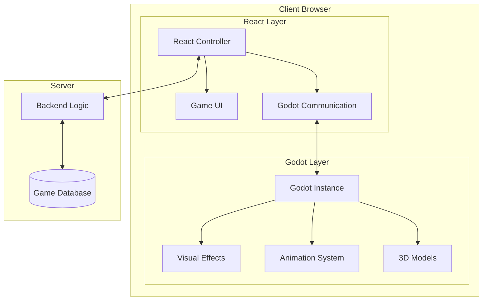
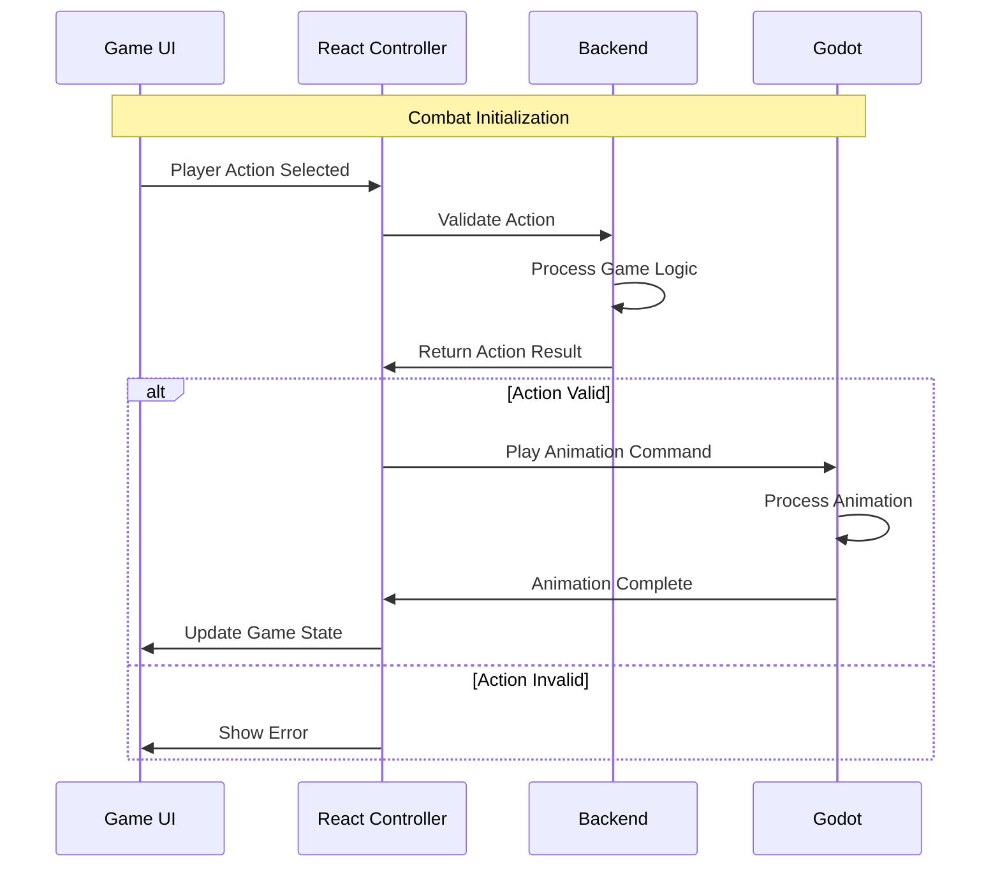
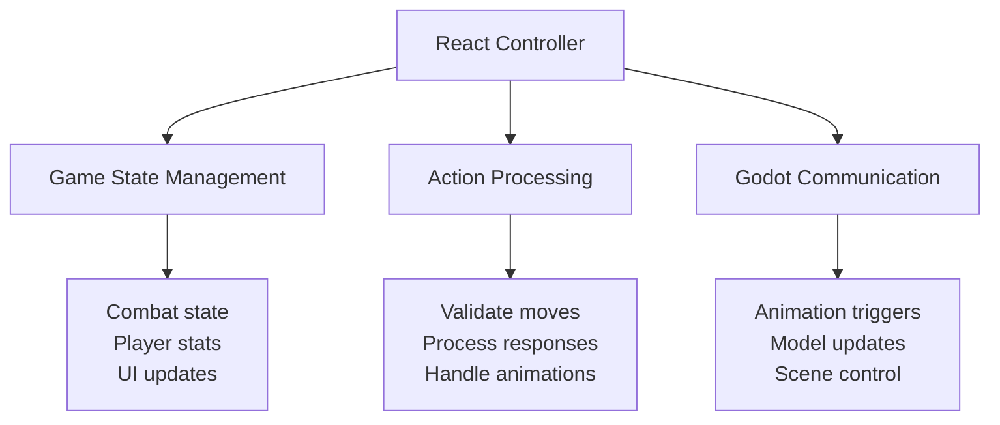
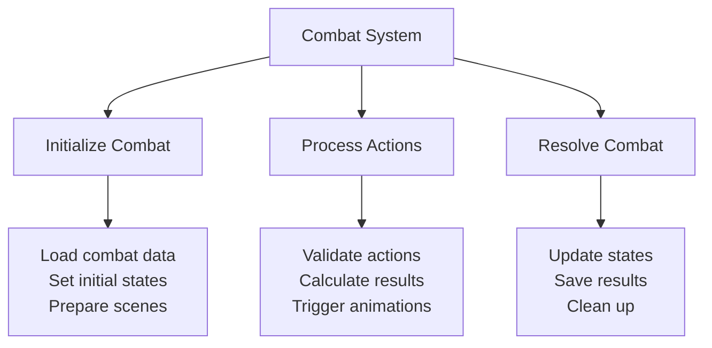
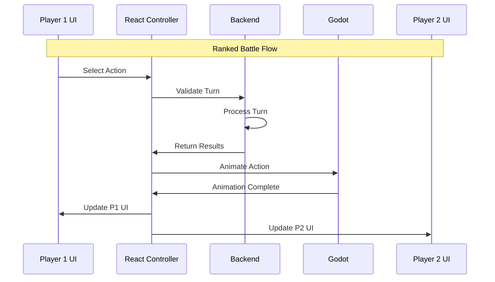
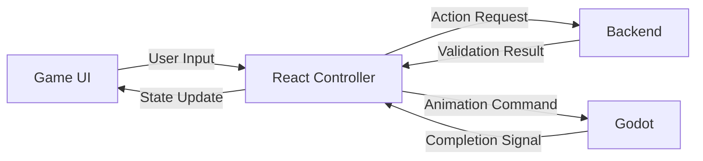
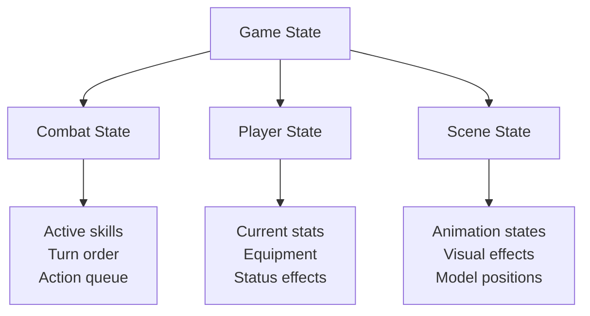
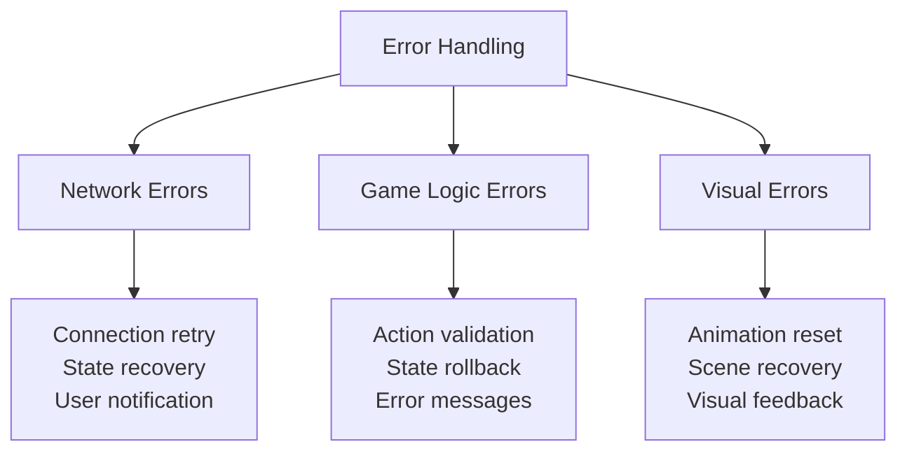

# Kyva Online - Gameplay Architecture

## Overview
The gameplay architecture consists of three main components working together:
- React (UI & Game Controller)
- Backend (.NET - Game Logic)
- Godot (3D Visualization)

## Core Architecture

## Combat Flow Architecture

## Detailed Component Communication

### React Controller Functions

### Combat System Architecture

## PvP Architecture

## Gameplay Data Flow

## Component Responsibilities

### React Controller
- Manages game state
- Processes user inputs
- Communicates with backend
- Controls Godot instance
- Updates UI

### Backend
- Validates all actions
- Processes game logic
- Maintains game state
- Manages player data
- Handles combat calculations

### Godot Instance
- Renders 3D scenes
- Plays animations
- Handles visual effects
- Manages model states
- Reports completion status

## State Management

## Error Handling

