# Kyva Online (会VA)
## Strategic Fantasy RPG

### Etymology
- **Name Origin**: Kyva (pronounced "KAI-va")
- **Japanese Element**: 会 (kai) - meaning "meeting" or "assembly"
- **VA Element**: Derived from Latin "via" (path/way)
- **Significance**: Represents the meeting point of strategic gameplay and community assembly

## Table of Contents
1. [Game Introduction](#game-introduction)
2. [Getting Started](#getting-started)
3. [Character Development](#character-development)
4. [Combat Systems](#combat-systems)
5. [Faction System](#faction-system)
6. [Social Features](#social-features)
7. [Economy & Trading](#economy--trading)
8. [Progression Systems](#progression-systems)

## Other documentations
1. [Technical Architecture](./TECHNICAL-ARCHITECTURE-DOCUMENTATION.md)
2. [Gameplay Architecture](./GAMEPLAY-ARCHITECTURE.md)

## Game Introduction

Kyva Online is a strategic RPG that emphasizes tactical combat, versatile character building, and social interaction. Players can continuously adapt their playstyle through different equipment and skill combinations, participate in various PvE and PvP content, and engage in a player-driven economy.

### Core Game Features
- Tactical turn-based combat
- Dynamic equipment and skill system
- Four distinct factions
- Player-driven economy
- Guild and social systems
- Ranked PvP with strategic elements

## Getting Started

### Initial Character Setup
1. **Beginning the Journey**
   - Selection of initial equipment loadout
   - Choice of 6 beginner skills
   - Basic tutorial guidance
   - Faction personality quiz

2. **Core Statistics**
   - Strength (STR): Physical damage and combat power
   - Intelligence (INT): Magical proficiency and spell power
   - Dexterity (DEX): Speed, accuracy, and evasion
   - Vitality (VIT): Health and defensive capabilities
   - Wisdom (WIS): Resource management and skill effectiveness

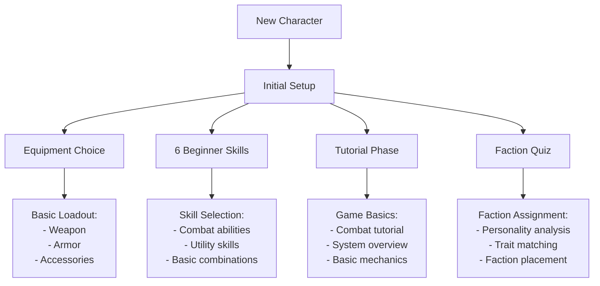

## Combat Systems

### PvE Combat
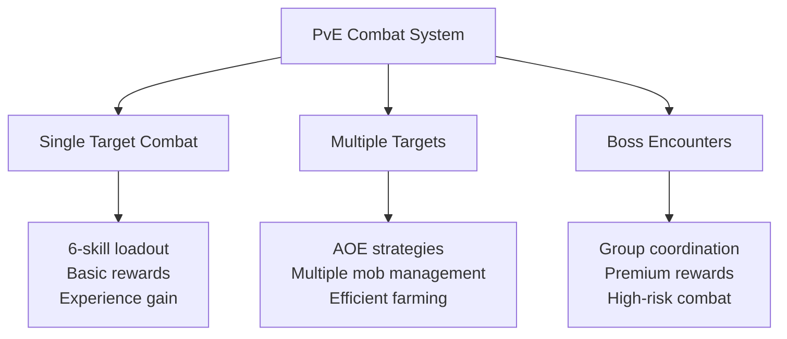

#### PvE Features
1. **Combat Mechanics**
   - 6-skill loadout system for all encounters
   - Strategic mob engagement
   - AOE combat capabilities
   - Boss raid mechanics

2. **Rewards**
   - Equipment drops
   - Materials
   - Experience points
   - In-game currency
   - Premium currency (rare)
   - New skills (from specific encounters)

### PvP Systems
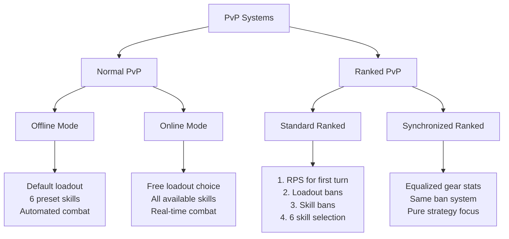

#### PvP Modes Detail

1. **Normal PvP**
   - **Offline Mode**
     - Uses player's preset defensive loadout
     - Automated combat using preset 6 skills
     - Other players can challenge your offline character
   
   - **Online Mode**
     - Real-time combat between players
     - Free choice of equipment and skills
     - No banning phase
     - Similar to PvE combat mechanics

2. **Ranked PvP**
   - **Standard Ranked**
     - Rock-Paper-Scissors for first turn
     - Loadout banning phase
     - Skill banning system (based on skill count):
       - 7 skills: Ban 1
       - 8 skills: Ban 2
       - 9+ skills: Ban 3
     - Turn-based skill selection (2 skills per turn until 6 total)
     - Combat based on speed and stat calculations
   
   - **Normalized Ranked**
     - Same rules as Standard Ranked
     - Equalized gear stats
     - Focus on pure strategy and skill

### Skill System
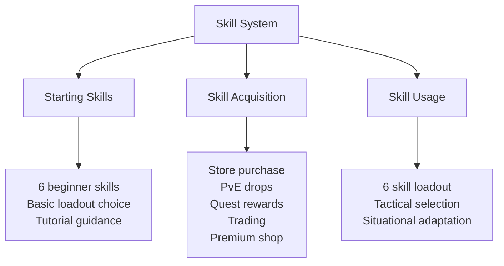

## Faction System
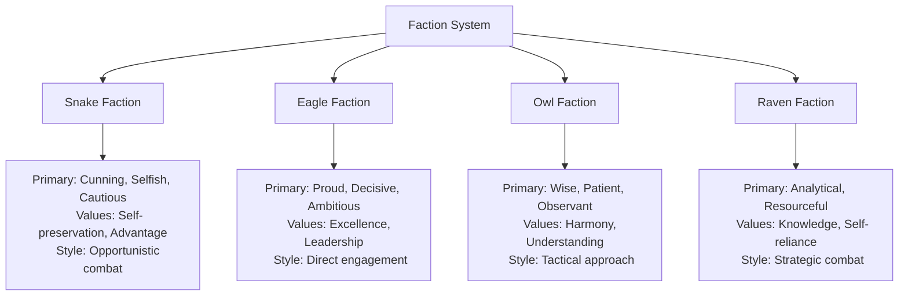

### Faction Details

1. **Snake Faction**
   - Primary Traits: Cunning, Selfish, Cautious
   - Secondary Traits: Deceptive, Opportunistic, Survivalist
   - Values: Self-preservation, Advantage, Secrecy

2. **Eagle Faction**
   - Primary Traits: Proud, Decisive, Ambitious
   - Secondary Traits: Competitive, Charismatic, Direct
   - Values: Excellence, Leadership, Achievement

3. **Owl Faction**
   - Primary Traits: Wise, Patient, Observant
   - Secondary Traits: Empathetic, Balanced, Diplomatic
   - Values: Wisdom, Harmony, Understanding

4. **Raven Faction**
   - Primary Traits: Analytical, Resourceful, Independent
   - Secondary Traits: Strategic, Practical, Adaptable
   - Values: Knowledge, Self-reliance, Versatility

### Faction Features
- Monthly faction change option
- Premium currency for immediate change
- Visible faction badges
- Faction-specific quests
- Faction-based achievements

## Social Features

### Guild System
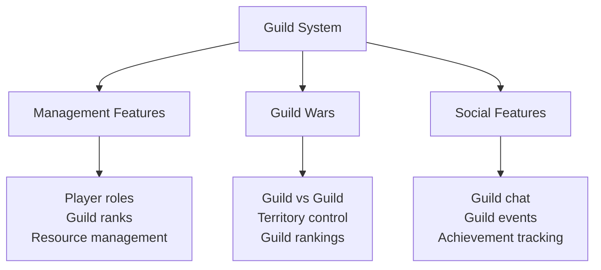

#### Guild Features Detail
- Player-managed organization
- Hierarchical role system
- Internal resource management
- Guild vs Guild warfare
- Guild achievement tracking
- Guild rankings and rewards

### Trading System
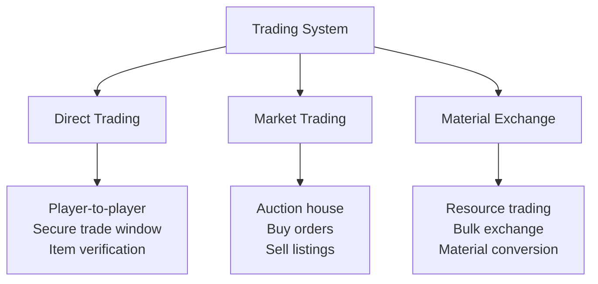

### Communication Systems
- Guild chat system
- Friend chat system
- Discord community integration
- Trading communication
- Combat coordination

## Economy Systems

### Currency Types
1. **Regular Currency**
   - Earned through PvE
   - Trading rewards
   - Quest completion
   - Achievement rewards

2. **Premium Currency**
   - Special purchases
   - Premium features
   - Faction changes
   - Exclusive items
   - Can be traded

### Market Systems
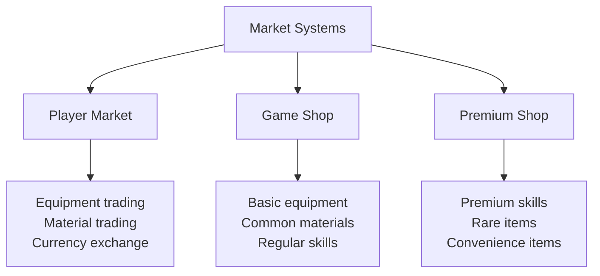

## Progression Systems

### Equipment Progression
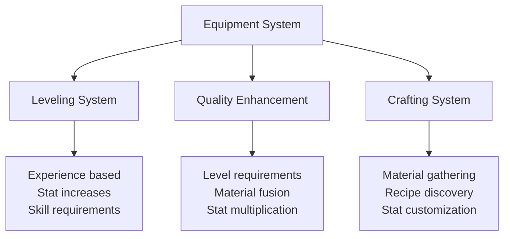

#### Quality Enhancement Process
1. Reach required level threshold
2. Collect necessary materials
3. Perform fusion process
4. Gain improved statistics
5. Unlock new potential

### Skill Progression

## Achievement System

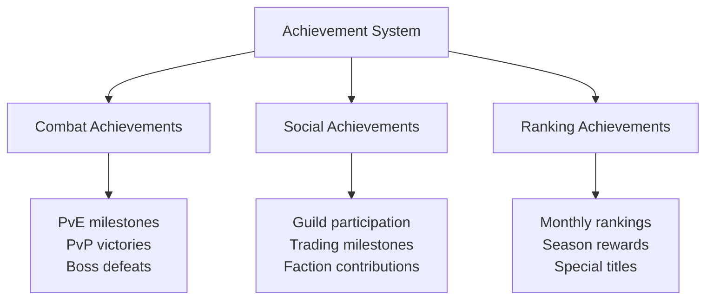

### Monthly Rankings and Rewards

#### Ranking Categories
1. **PvP Rankings**
   - Standard ranked ladder
   - Normalized ranked ladder
   - Monthly rewards tier
   - Special titles and badges

2. **PvE Rankings**
   - Boss clear times
   - Farming efficiency
   - Challenge completions
   - Special achievements

3. **Economic Rankings**
   - Trading volume
   - Market participation
   - Material conversion
   - Crafting achievements

#### Monthly Rewards
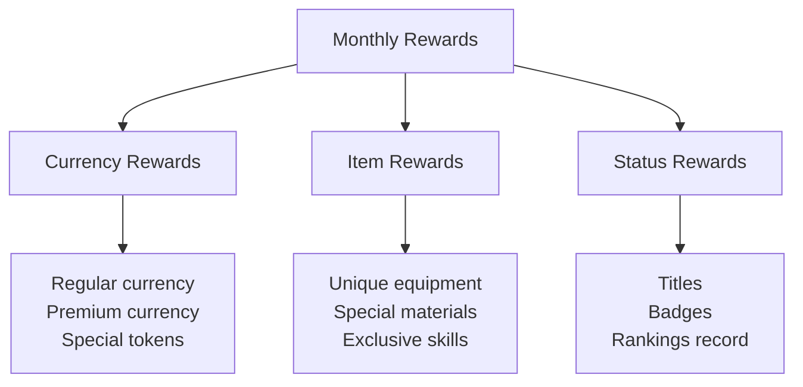

### Progression Tracking

1. **Character Progress**
   - Level progression
   - Gear advancement
   - Skill collection
   - Achievement points

2. **Combat Stats**
   - PvE completion rates
   - PvP win/loss ratio
   - Boss clear records
   - Ranking history

3. **Social Progress**
   - Guild contributions
   - Trading statistics
   - Faction reputation
   - Community involvement

4. **Economic Status**
   - Currency holdings
   - Market transactions
   - Material collections
   - Crafting success
