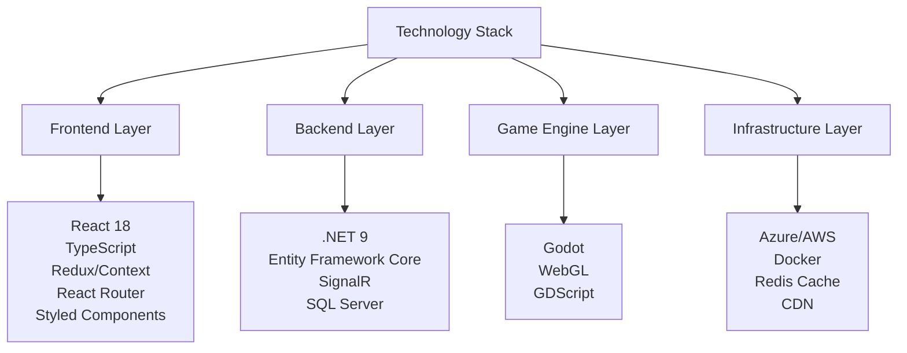
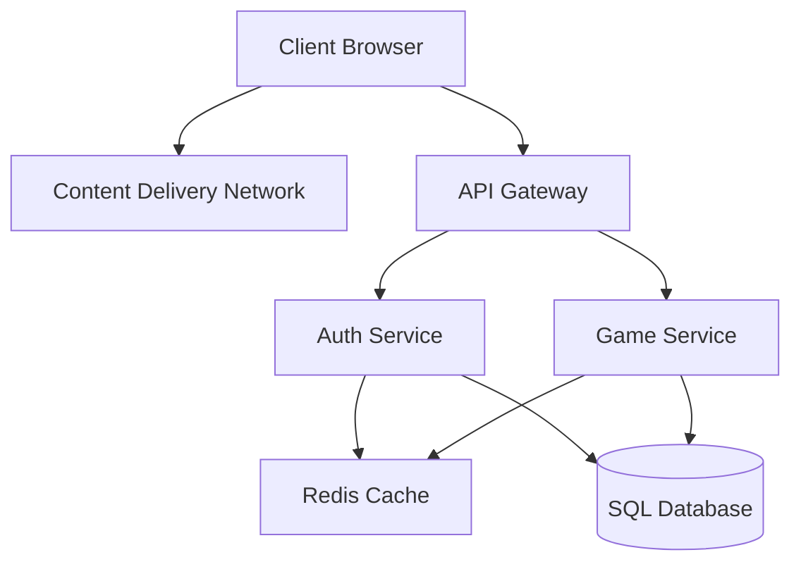
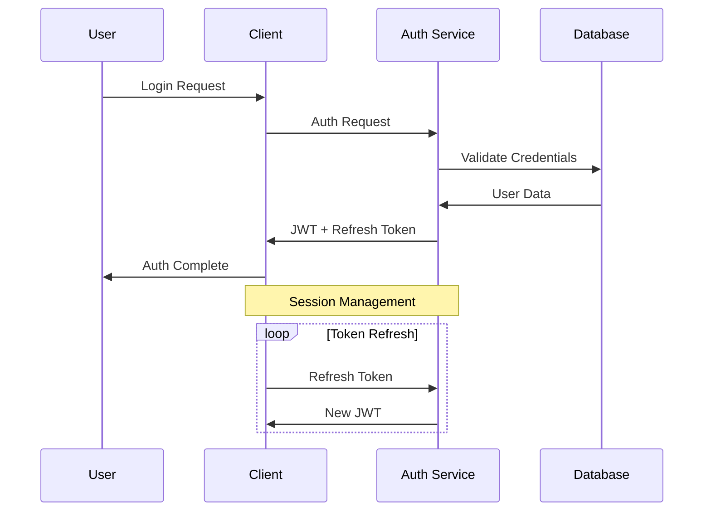
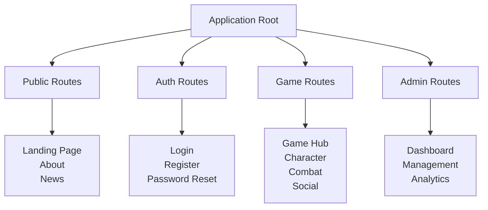
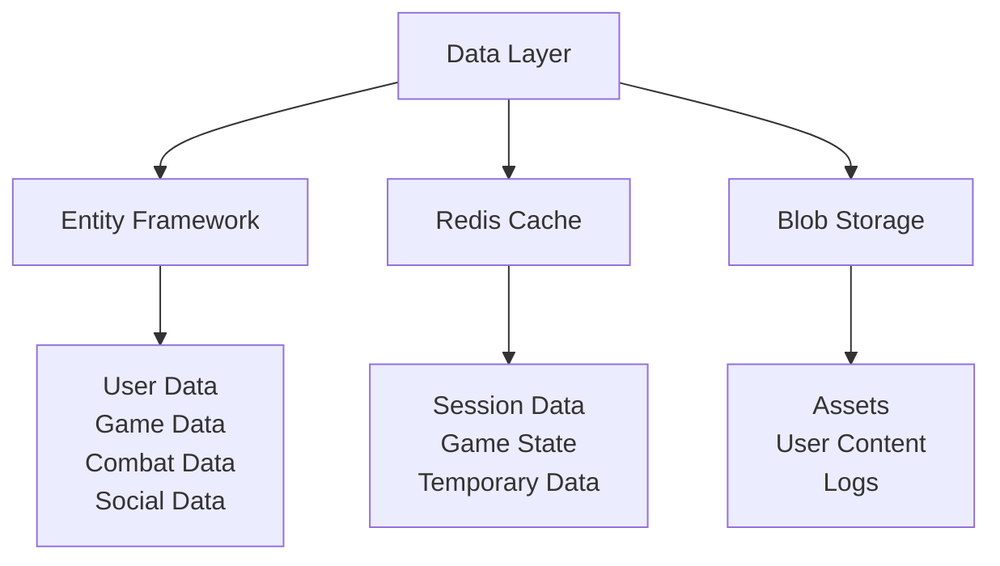
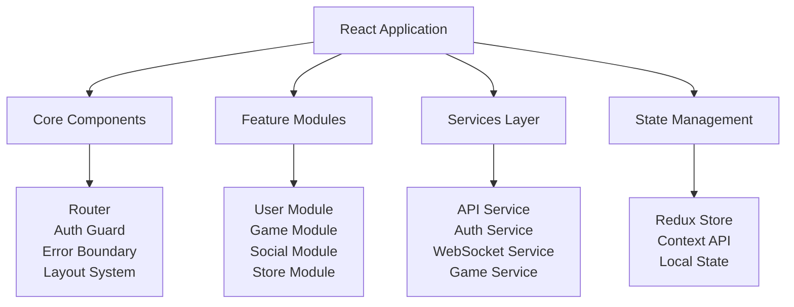
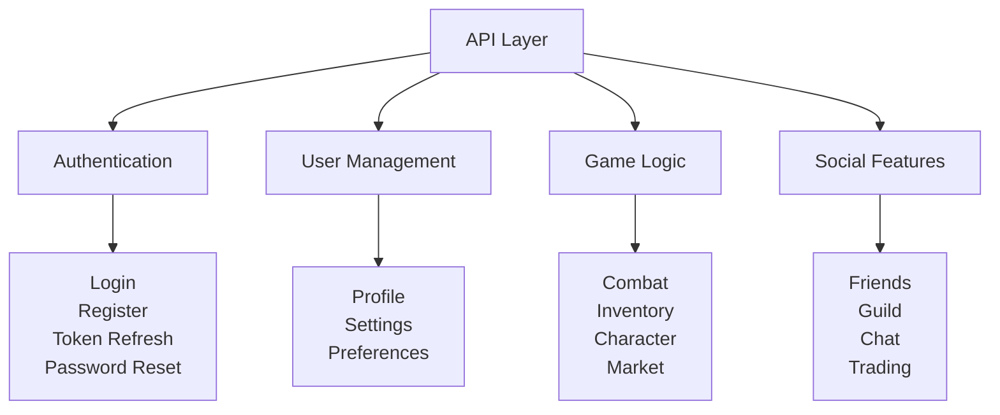
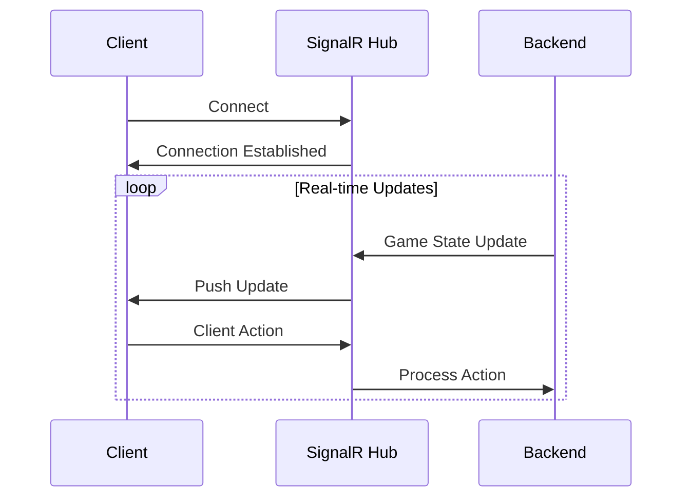
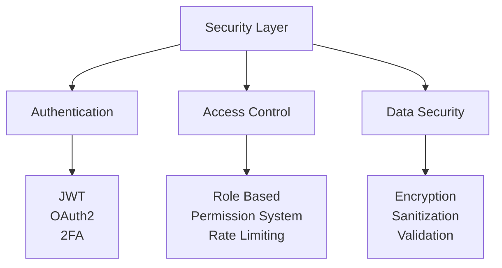
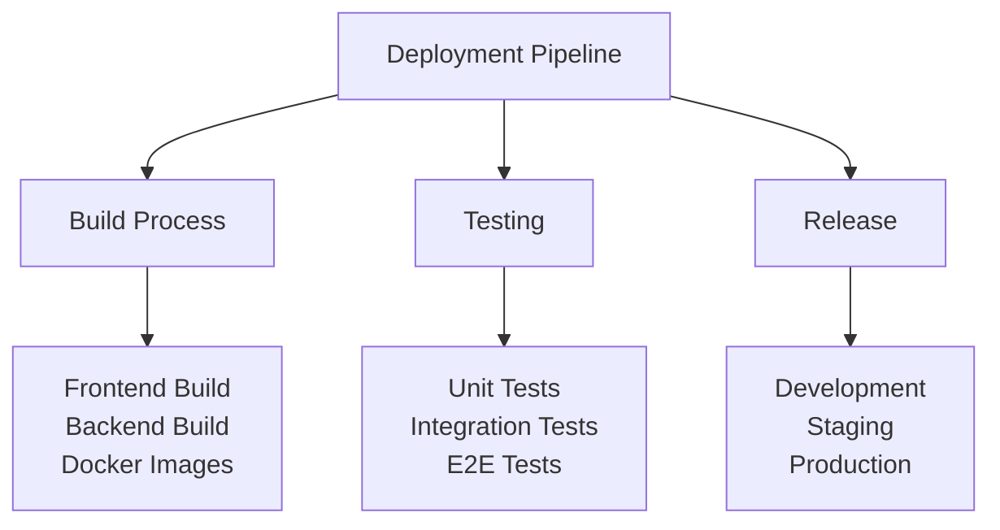

# Kyva Online - Technical Architecture Documentation

## Technology Stack Overview



## System Architecture



## Authentication Flow



## Application Components



## Data Layer Architecture



## Frontend Architecture



## API Structure



## Real-time Communication



## Security Architecture



## Deployment Architecture



## Project Structure
```
project/
├── client/
│   ├── src/
│   │   ├── components/
│   │   │   ├── common/
│   │   │   ├── game/
│   │   │   ├── social/
│   │   │   └── store/
│   │   ├── pages/
│   │   ├── services/
│   │   ├── hooks/
│   │   ├── store/
│   │   └── utils/
│   └── public/
├── server/
│   ├── Kyva.API/
│   ├── Kyva.Core/
│   ├── Kyva.Infrastructure/
│   ├── Kyva.Domain/
│   └── Kyva.Tests/
├── godot/
│   ├── scenes/
│   ├── scripts/
│   └── assets/
└── infrastructure/
    ├── docker/
    ├── kubernetes/
    └── terraform/
```

## Implementation Notes

### Frontend Development
- TypeScript for type safety
- Module-based architecture
- Lazy loading for routes
- Component-driven development
- State management patterns

### Backend Development
- Clean architecture principles
- Domain-driven design
- CQRS pattern where applicable
- Microservices architecture
- Event-driven systems

### DevOps
- CI/CD pipeline
- Container orchestration
- Infrastructure as code
- Monitoring and logging
- Automated testing
